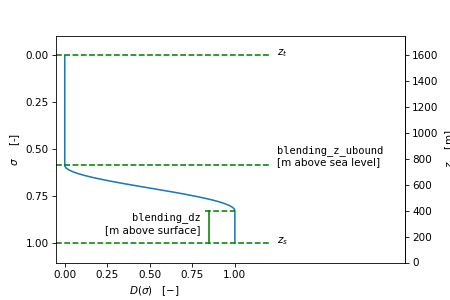

# INIFOR User Documentation


# 1 Overview

[INIFOR](https://palm.muk.uni-hannover.de/trac/browser/palm/trunk/UTIL/inifor) is a meteorological data preprocessor for
PALM. INIFOR computes initial and boundary conditions from COSMO model output and stores it in a dynamic driver netCDF
file required for PALM\'s [offline nesting](https://palm.muk.uni-hannover.de/trac/wiki/doc/tec/nesting#offl) feature.

We describe INIFOR\'s interpolation methodology in detail in our article[^1]:

-   Kadasch, E., Sühring, M., Gronemeier, T., and Raasch, S.: Mesoscale nesting interface of the PALM model system 6.0,
    *Geosci. Model Dev.*, 14, 5435--5465, <https://doi.org/10.5194/gmd-14-5435-2021>, 2021.

# 2 Getting started

## 2.1 Installation

INIFOR can be installed using the provided `install` script as follows:

``` bash
bash install -p <install-prefix>
export PATH=<install-prefix>/bin:${PATH}
```

Please change the `<install-prefix>` to your desired installation directory, e.g. `$HOME/local`. The install script will
read your shell environment try to find a suitable Fortran compiler and netCDF library, compile INIFOR and copy the
compiled binary to `<install-prefix>/bin`.

To make the `inifor` command available to you in all new shell sessions, you can add the installation directory
permanently to your bash environment:

``` bash
echo 'export PATH=<install-prefix>/bin:${PATH}' >> ~/.bashrc
```

Use the option `-h` to get all available options of the `install` script.

## 2.2 Minimal usage example

1.  Customize `./namelist` (number or grid points and spacings, end_time)

2.  Run:

    ``` bash
    inifor --path <scenario path> \
           --date <YYYYMMDD> \
           --elevation <height of z origin above sea level>
    ```

# 3 Usage

In order to run, INIFOR requires three kinds of inputs:

1.  hourly COSMO model output,
2.  a steering namelist file, and
3.  command-line options.

In addition, a static driver file may be supplied (see `--static-driver` option below) in order to pass the coordinates
of the PALM origin to INIFOR. If no static driver is passed to INIFOR, origin coordinates are read from the namelist
file.

A typical `inifor` call looks like this:

``` bash
inifor --path /data/evaluation/20170729 --date 2017073006 \
       --init-mode profile -n namelist -o dynamic_driver.nc \
       --elevation 110 --input-prefix lff0_
```

# 4 Input data: COSMO model output

## 4.1 Overview

INIFOR processes COSMO model output which it requires to be stored in a set of netCDF files located in a user-specified
path (see `--path` option). These are:

-   hhl.nc: This file provides the COSMO numerical grid. (*hhl* abbreviates *height of half layers*, i.e. the heights of
    the vertical cell boundaries.)
-   soil.nc: This file provides the COSMO soil map and is used to destinguish land from water cells.
-   `<prefix>YYYYMMDDHH-<suffix>.nc`: Each of these files contains COSMO model of one time step at the given time in UTC
    (Y..year, M..month, D..day, H..hour).
    -   The `<prefix>` distinguishes different DWD products, for instance COSMO analyses (`laf`) or forecasts (`lff`).
    -   The `<suffix>` distinguishes thee kinds of COSMO model output data, namely
        -   `flow` (atmospheric fields)
        -   `soil` (soil moisture and temperature)
        -   `precip` (surface precipitation rates, optional)
    -   For example, laf2016010100-flow.nc contains the atmospheric fields of the COSMO analysis of January 1st, 2016
        for 0:00 UTC.

How to download COSMO model output from the DWD data portal Pamore is described in this
[manual](https://palm.muk.uni-hannover.de/trac/attachment/wiki/doc/app/iofiles/inifor/manual_data_preparation_using_pamore_Jan2020.pdf).

## 4.2 Required netCDF variables

Variables in `hhl.nc`

``` 
double rlon(rlon) ;
        rlon:standard_name = "grid_longitude" ;
        rlon:long_name = "longitude in rotated pole grid" ;
        rlon:units = "degrees" ;
        rlon:axis = "X" ;
double rlat(rlat) ;
        rlat:standard_name = "grid_latitude" ;
        rlat:long_name = "latitude in rotated pole grid" ;
        rlat:units = "degrees" ;
        rlat:axis = "Y" ;
char rotated_pole ;
        rotated_pole:grid_mapping_name = "rotated_latitude_longitude" ;
        rotated_pole:grid_north_pole_latitude = 40. ;
        rotated_pole:grid_north_pole_longitude = -170. ;
float HHL(time, height, rlat, rlon) ;
        HHL:long_name = "Geometric Height of the layer limits above sea level(NN)" ;
        HHL:units = "m" ;
        HHL:param = "6.3.0" ;
        HHL:grid_mapping = "rotated_pole" ;
```

Variables in `soil.nc`

``` 
float SOILTYP(time, rlat, rlon) ;
        SOILTYP:long_name = "soil type of grid (1...9, local soilType.table)" ;
        SOILTYP:units = "Numeric" ;
        SOILTYP:param = "196.3.2" ;
        SOILTYP:grid_mapping = "rotated_pole" ;
```

Variables in `<prefix>YYYYMMDDHH-flow.nc` files:

``` 
float W(time, height, rlat, rlon) ;
        W:long_name = "Vertical Velocity (Geometric) (w)" ;
        W:units = "m s-1" ;
        W:param = "9.2.0" ;
        W:grid_mapping = "rotated_pole" ;
float U(time, height_2, rlat, rlon_2) ;
        U:standard_name = "eastward_wind" ;
        U:long_name = "U-Component of Wind" ;
        U:units = "m s-1" ;
        U:param = "2.2.0" ;
        U:grid_mapping = "rotated_pole" ;
float V(time, height_2, rlat_2, rlon) ;
        V:standard_name = "northward_wind" ;
        V:long_name = "V-Component of Wind" ;
        V:units = "m s-1" ;
        V:param = "3.2.0" ;
        V:grid_mapping = "rotated_pole" ;
float T(time, height_2, rlat, rlon) ;
        T:standard_name = "air_temperature" ;
        T:long_name = "Temperature" ;
        T:units = "K" ;
        T:param = "0.0.0" ;
        T:grid_mapping = "rotated_pole" ;
float P(time, height_2, rlat, rlon) ;
        P:long_name = "Pressure" ;
        P:units = "Pa" ;
        P:param = "192.3.0" ;
        P:grid_mapping = "rotated_pole" ;
float QV(time, height_2, rlat, rlon) ;
        QV:standard_name = "specific_humidity" ;
        QV:long_name = "Specific Humidity" ;
        QV:units = "kg kg-1" ;
        QV:param = "0.1.0" ;
        QV:grid_mapping = "rotated_pole" ;
```

Variables in `<prefix>YYYYMMDDHH-soil.nc` files:

``` 
double depth_2(depth_2) ;
        depth_2:long_name = "depth_below_land" ;
        depth_2:units = "m" ;
        depth_2:positive = "down" ;
        depth_2:axis = "Z" ;
        depth_2:bounds = "depth_2_bnds" ;
float T_SO(time, depth, rlat, rlon) ;
        T_SO:long_name = "Soil Temperature (multilayer model)" ;
        T_SO:units = "K" ;
        T_SO:param = "18.3.2" ;
        T_SO:grid_mapping = "rotated_pole" ;
float W_SO(time, depth_2, rlat, rlon) ;
        W_SO:long_name = "Column-integrated Soil Moisture (multilayers)" ;
        W_SO:units = "kg m-2" ;
        W_SO:param = "20.3.2" ;
        W_SO:grid_mapping = "rotated_pole" ;
```

## 4.3 Optional variables

Variables in `<prefix>YYYYMMDDHH-flow.nc` files (will be interpolated automatically if present in input files):

``` 
float QC(time, height_2, rlat, rlon) ;
        QC:long_name = "Cloud Mixing Ratio" ;
        QC:units = "kg kg-1" ;
        QC:param = "22.1.0" ;
        QC:grid_mapping = "rotated_pole" ;
float QI(time, height_2, rlat, rlon) ;
        QI:long_name = "Cloud Ice Mixing Ratio" ;
        QI:units = "kg kg-1" ;
        QI:param = "82.1.0" ;
        QI:grid_mapping = "rotated_pole" ;
float QR(time, height_2, rlat, rlon) ;
        QR:long_name = "Rain mixing ratio" ;
        QR:units = "kg kg-1" ;
        QR:param = "24.1.0" ;
        QR:grid_mapping = "rotated_pole" ;
float QS(time, height_2, rlat, rlon) ;
        QS:long_name = "Snow mixing ratio" ;
        QS:units = "kg kg-1" ;
        QS:param = "25.1.0" ;
        QS:grid_mapping = "rotated_pole" ;
float QG(time, height_2, rlat, rlon) ;
        QG:long_name = "Grauple" ;
        QG:units = "kg kg-1" ;
        QG:param = "32.1.0" ;
        QG:grid_mapping = "rotated_pole" ;
```

Variables in `<prefix>YYYYMMDDHH-precip.nc` files (can be added to INIFOR processing with the `--precipitation` option):

``` 
float RAIN_GSP(time, rlat, rlon) ;
        RAIN_GSP:long_name = "Large scale rain (Accumulation)" ;
        RAIN_GSP:units = "kg m-2" ;
        RAIN_GSP:param = "77.1.0" ;
        RAIN_GSP:grid_mapping = "rotated_pole" ;
float SNOW_GSP(time, rlat, rlon) ;
        SNOW_GSP:long_name = "Large-Scale snowfall - water equivalent (Accumulation)" ;
        SNOW_GSP:units = "kg m-2" ;
        SNOW_GSP:param = "56.1.0" ;
        SNOW_GSP:grid_mapping = "rotated_pole" ;
float GRAU_GSP(time, rlat, rlon) ;
        GRAU_GSP:long_name = "Graupel (snow pellets) precipitation (Accumulation)" ;
        GRAU_GSP:units = "kg m-2" ;
        GRAU_GSP:param = "75.1.0" ;
        GRAU_GSP:grid_mapping = "rotated_pole" ;
```

# 5 Namelist parameters

INIFOR mirrors a subset of the PALM's Fortran namelists `initialization_parameters` and `runtime_parameters` and
supports the parameters listed below. Note that, at the moment, INIFOR uses the old namelist descriptors `inipar` and
`d3par` instead, which are the descriptors used in previous versions of PALM.

## 5.1 Example namelist file

```fortran 
&inipar nx = 4679, ny = 3939, nz = 360
        dx = 10., dy = 10., dz = 10.
        dz_stretch_level = 2500.0, dz_stretch_factor = 1.08, dz_max = 100.0
        longitude = 13.082744, latitude = 52.325079
/

&d3par  end_time = 86400.0
/
```

## 5.2 `inipar` paramters

<table style="width:98%;">
<colgroup>
<col style="width: 33%" />
<col style="width: 21%" />
<col style="width: 42%" />
</colgroup>
<thead>
<tr class="header">
<th style="text-align: left;">Parameter name</th>
<th style="text-align: left;">Default value</th>
<th style="text-align: left;">Description</th>
</tr>
</thead>
<tbody>
<tr class="odd">
<td style="text-align: left;">nx, ny, nz</td>
<td style="text-align: left;">None</td>
<td style="text-align: left;">Number of PALM grid points in x, y, and z direction</td>
</tr>
<tr class="even">
<td style="text-align: left;">dx, dy, dz(10)</td>
<td style="text-align: left;">None</td>
<td style="text-align: left;">PALM grid spacings in x, y, and z direction [m]</td>
</tr>
<tr class="odd">
<td style="text-align: left;">dz_stretch_level</td>
<td style="text-align: left;">-9999999.9</td>
<td style="text-align: left;">Height above which the grid will be stretched [m]</td>
</tr>
<tr class="even">
<td style="text-align: left;">dz_stretch_factor</td>
<td style="text-align: left;">1.08</td>
<td style="text-align: left;">Factor by which the grid will be stretched</td>
</tr>
<tr class="odd">
<td style="text-align: left;">dz_max</td>
<td style="text-align: left;">1000.0</td>
<td style="text-align: left;">Maximum vertical grid spacing [m]</td>
</tr>
<tr class="even">
<td style="text-align: left;">dz_stretch_level_start(9)</td>
<td style="text-align: left;">-9999999.9</td>
<td style="text-align: left;">Array of height levels above which the grid is to be stretched vertically [m]</td>
</tr>
<tr class="odd">
<td style="text-align: left;">dz_stretch_level_end(9)</td>
<td style="text-align: left;">9999999.9</td>
<td style="text-align: left;">Array of height levels until which the grid is to be stretched vertically [m]</td>
</tr>
<tr class="even">
<td style="text-align: left;">longitude, latitude</td>
<td style="text-align: left;">0.0</td>
<td style="text-align: left;">Geographical coordinates of the PALM origin [deg]. Both will be ignored if the command-line option <code>--static-driver</code> is used (see below).</td>
</tr>
<tr class="odd">
<td style="text-align: left;">blending_dz</td>
<td style="text-align: left;">250.0</td>
<td style="text-align: left;">descr [m]</td>
</tr>
<tr class="even">
<td style="text-align: left;">blending_z_ubound</td>
<td style="text-align: left;">1000.0</td>
<td style="text-align: left;">descr [m]</td>
</tr>
</tbody>
</table>

## 5.3 `d3par` parameters

<table style="width:97%;">
<colgroup>
<col style="width: 24%" />
<col style="width: 24%" />
<col style="width: 48%" />
</colgroup>
<thead>
<tr class="header">
<th style="text-align: left;">Parameter name</th>
<th style="text-align: left;">Default value</th>
<th style="text-align: left;">Description</th>
</tr>
</thead>
<tbody>
<tr class="odd">
<td style="text-align: left;">end_time</td>
<td style="text-align: left;">0.0</td>
<td style="text-align: left;">PALM simulation time. INIFOR will produce hourly forcing data from the start date (see <code>-d/--date</code> command-line option) to <code>end_time</code> seconds thereafter. [s]</td>
</tr>
</tbody>
</table>

# 6 Command-line options

## INIFOR configuration

<table style="width:97%;">
<colgroup>
<col style="width: 28%" />
<col style="width: 23%" />
<col style="width: 46%" />
</colgroup>
<thead>
<tr class="header">
<th style="text-align: left;">Option</th>
<th style="text-align: left;">Default value</th>
<th style="text-align: left;">Description</th>
</tr>
</thead>
<tbody>
<tr class="odd">
<td style="text-align: left;">--averaging-mode &lt;mode&gt;</td>
<td style="text-align: left;">level</td>
<td style="text-align: left;">Selects how averaged quantities (large-scale forcing terms) are computed. INIFOR supports averaging along input model levels (‘level’) and along constant heights (‘height’).</td>
</tr>
<tr class="even">
<td style="text-align: left;">-a, --averaging-angle &lt;angle&gt;</td>
<td style="text-align: left;">2.0</td>
<td style="text-align: left;">Width of the averaging box in longitudal and latitudal direction in the source coordinate system (COSMO rotated-pole) [deg].</td>
</tr>
<tr class="odd">
<td style="text-align: left;">-d, --date &lt;date&gt;</td>
<td style="text-align: left;">20130721</td>
<td style="text-align: left;">Start date of the simulation in the form YYYYMMDD or YYYYMMDDHH. If no hours (HH) are given, INIFOR assumes that the simulation starts at O UTC on that day.</td>
</tr>
<tr class="even">
<td style="text-align: left;">-i, --init-mode &lt;mode&gt;</td>
<td style="text-align: left;">profile</td>
<td style="text-align: left;">Set the PALM initialization mode. INIFOR can provide initial conditions as either profiles or three-dimensional fields. The corresponding modes are ‘profile’ and ‘volume’.</td>
</tr>
<tr class="odd">
<td style="text-align: left;">-f, --forcing-mode &lt;mode&gt;</td>
<td style="text-align: left;">hetero</td>
<td style="text-align: left;">Set the PALM forcing mode. INIFOR can supply heterogeneous boundary conditions spatially interpolated from the mesoscale model (‘hetero’) or homogenous boundary conditions horizontally averaged over the PALM domain (‘homo’).</td>
</tr>
<tr class="even">
<td style="text-align: left;">--soil-init-mode &lt;mode&gt;</td>
<td style="text-align: left;">volume</td>
<td style="text-align: left;">Set the PALM soil initialization mode. INIFOR can provide initial soil data as either profiles or three-dimensional fields. The corresponding modes are ‘profile’ and ‘volume’.</td>
</tr>
<tr class="odd">
<td style="text-align: left;">-r, --surface-pressure &lt;pressure&gt;</td>
<td style="text-align: left;">1e5</td>
<td style="text-align: left;">Manually set the pressure at z=0 in the PALM domain [Pa]. If not given, the surface pressure is computed from the COSMO pressure field.</td>
</tr>
<tr class="even">
<td style="text-align: left;">-z, --elevation &lt;height&gt;</td>
<td style="text-align: left;">35.0</td>
<td style="text-align: left;">Specifies the elevation of the PALM domain above sea level [m].</td>
</tr>
</tbody>
</table>

## I/O

<table style="width:97%;">
<colgroup>
<col style="width: 24%" />
<col style="width: 26%" />
<col style="width: 46%" />
</colgroup>
<thead>
<tr class="header">
<th style="text-align: left;">Option</th>
<th style="text-align: left;">Default value</th>
<th style="text-align: left;">Description</th>
</tr>
</thead>
<tbody>
<tr class="odd">
<td style="text-align: left;">-l, --hhl-file &lt;netCDF file&gt;</td>
<td style="text-align: left;">./hhl.nc</td>
<td style="text-align: left;">Location of the netCDF file containing the vertical COSMO-DE grid levels, specifically the heights of half levels (hhl, i.e. vertical cell faces).</td>
</tr>
<tr class="even">
<td style="text-align: left;">-n, --namelist &lt;namelist file&gt;</td>
<td style="text-align: left;">./namelist</td>
<td style="text-align: left;">Location of the PALM namelist file. INIFOR expects the file to contain two namelists, <code>inipar</code> and <code>d3par</code>, from which it will read grid parameters and the simulation time.</td>
</tr>
<tr class="odd">
<td style="text-align: left;">-o, --output &lt;output file&gt;</td>
<td style="text-align: left;">./palm-4u-input.nc</td>
<td style="text-align: left;">Name of the INIFOR output file, i.e. the PALM dynamic driver.</td>
</tr>
<tr class="even">
<td style="text-align: left;">-p, --path &lt;scenario path&gt;</td>
<td style="text-align: left;">./</td>
<td style="text-align: left;">Scenario path, i.e. the path of the meteorological input data.</td>
</tr>
<tr class="odd">
<td style="text-align: left;">-s, --soil-file &lt;netCDF file&gt;</td>
<td style="text-align: left;">&lt;scenario path&gt;/soil.nc</td>
<td style="text-align: left;">Location of the netCDF file containing the COSMO-DE soil type map.</td>
</tr>
<tr class="even">
<td style="text-align: left;">-t, --static-driver &lt;netCDF file&gt;</td>
<td style="text-align: left;">None</td>
<td style="text-align: left;">Location of the netCDF static driver file for the case to be simulated with PALM. If given, INIFOR will ignore the namelist parameters <code>longitude</code> and <code>latitude</code> and will instead read the geographical coordinates for PALM’s origin from the static driver attributes <code>origin_lon</code>, <code>origin_lat</code>, and <code>origin_z</code>.</td>
</tr>
</tbody>
</table>

## File prefixes

<table style="width:98%;">
<colgroup>
<col style="width: 31%" />
<col style="width: 21%" />
<col style="width: 43%" />
</colgroup>
<thead>
<tr class="header">
<th style="text-align: left;">Option</th>
<th style="text-align: left;">Default value</th>
<th style="text-align: left;">Description</th>
</tr>
</thead>
<tbody>
<tr class="odd">
<td style="text-align: left;">--input-prefix &lt;prefix&gt;</td>
<td style="text-align: left;">laf</td>
<td style="text-align: left;">Set the file prefixes for all input files. Individual prefixes can be overwritten with the options below.</td>
</tr>
<tr class="even">
<td style="text-align: left;">--flow-prefix &lt;prefix&gt;</td>
<td style="text-align: left;">laf</td>
<td style="text-align: left;">Set the file prefix of flow input files.</td>
</tr>
<tr class="odd">
<td style="text-align: left;">--precipitation-prefix &lt;prefix&gt;</td>
<td style="text-align: left;">laf</td>
<td style="text-align: left;">Set the file prefix of precipitation input files.</td>
</tr>
<tr class="even">
<td style="text-align: left;">--soil-prefix &lt;prefix&gt;</td>
<td style="text-align: left;">laf</td>
<td style="text-align: left;">Set the file prefix of soil input files.</td>
</tr>
</tbody>
</table>

## Non-argument options

<table style="width:97%;">
<colgroup>
<col style="width: 25%" />
<col style="width: 72%" />
</colgroup>
<thead>
<tr class="header">
<th style="text-align: left;">Option</th>
<th style="text-align: left;">Description</th>
</tr>
</thead>
<tbody>
<tr class="odd">
<td style="text-align: left;">--debug</td>
<td style="text-align: left;">Enable additional terminal messages and netCDF output for debugging.</td>
</tr>
<tr class="even">
<td style="text-align: left;">--map-terrain</td>
<td style="text-align: left;">Turn on mesoscale-microscale terrain mapping. Requires <code>--static-driver &lt;netCDF file&gt;</code>.</td>
</tr>
<tr class="odd">
<td style="text-align: left;">--precipitation</td>
<td style="text-align: left;">Turn on surface precipitation output. Requires COSMO precipitation output (<code>*-precip.nc</code> files)</td>
</tr>
<tr class="even">
<td style="text-align: left;">--version</td>
<td style="text-align: left;">Output version number and exit.</td>
</tr>
</tbody>
</table>

# 7 Methodology

You can find a detailed description of INIFOR\'s interpolation methodology in our article[^1]:

-   Kadasch, E., Sühring, M., Gronemeier, T., and Raasch, S.: Mesoscale nesting interface of the PALM model system 6.0,
    *Geosci. Model Dev.*, 14, 5435--5465, <https://doi.org/10.5194/gmd-14-5435-2021>, 2021.

The mesoscale-microscale terrain mapping was developed after this publication and is described below.

## 7.1 Mesoscale-microscale terrain mapping

### 7.1.1 Overview

Terrain mapping in INIFOR helps provide better initial and boundary conditions close to the surface --- especially on
mountainous terrain --- by stretching COSMO's atmosphere to match PALM's terrain.

To use this feature

1.  turn it on using the command-line option `--map-terrain`,
2.  supply a static driver including the terrain height `zt` using `--static-driver <path>`, and
3.  optionally, specify the namelist parameters `blending_z_ubound` (default: 1000.0 m) and `blending_dz` (250.0 m).

INIFOR's terrain mapping is designed with convective boundary layers in mind, which feature a surface layer and a
boundary layer-top inversion with strong vertical gradients and a well mixed part inbetween. With this method we want to
be able to

1.  maintain the structure of the surface layer (the bottom 10% of the boundary layer (Stull, 1991, p. 10[^2]) and
2.  avoid vertically displacing the inversion height.

For this, the two namelist parameters allow defining a window where most of the vertical stretching occurs, preferably
in the core of the boundary layer. By setting `blending_z_ubound` well below the lowest boundary layer height, we avoid
shifting the inversion vertically and by setting `blending_dz` above the surface layer, we avoid excessively streting
it. (see Fig. 2 below).

### 7.1.2 Concept

INIFOR's terrain mapping is based on the sigma-$`z`$ coordinate similar to Pielke and Martin's (1981)[^3]:

```math
\sigma(x,y,z) = \frac{z - z_t}{z_s(x,y) - z_t}
```

which represents a relative vertical position within the respecive mesoscale model column. Per this definition,
$`\sigma(z_t) = 0`$ at the model top and $`\sigma(z_s) = 1`$ at the surface.

Conversely, given the sigma-$`z`$ coordinate of a grid level, we obtain the metric height by evaluating

```math
z(\sigma) = z_t + \sigma (z_s - z_t)\,.
```

Here, the mesoscale model column height $`(z_s - z_t)`$ serves as a length scale for converting the nondimensional
$`\sigma`$ coordinate to dimensional $`z`$ coordinate. Given the sigma-$`z`$ coordinate of a grid level, we obtain the
original height by scaling sigma using the mesoscale length scale. If we were to replace the mesoscale column hight with
one modified accoring to the miscroscale terrain, $`(z'_s - z_t)`$, we obtain a vertical grid mapped to the microscale
terrain $`z'_s(x,y)`$.

In order to avoid shifting the levels across the entire column, we do not use the modified column height over the entire
vertical coordinate but rather blend between the original and modified column length scale according to a smooth window
function $`D(\sigma)`$:

```math
\begin{aligned}
\begin{align}
    z(\sigma) = z_t + \sigma \, [ \, (1 - D(\sigma)) \, (z_s - z_t)&\nonumber\\
                                     + \, D(\sigma)  \,\, (z'_s - z_t)&\nonumber\, ]\,.
\end{align}
\end{aligned}
```

For the blending, we use a piecewise constant function with a cosine-shaped transition in the middle:

```math
\begin{aligned}
D(\sigma) = \left\{ \begin{array}{ll}
    0 \quad & \mbox{if} \quad \sigma < \sigma_0 \\
    1 \quad & \mbox{if} \quad \sigma > \sigma_1 \\
    \frac 12 \left( 1 - \cos(\pi \frac{\sigma - \sigma_0}{\sigma_0 - \sigma_1}) \right)& \mbox{else}
\end{array} \right.
\end{aligned}
```

Figure 1 below shows an example, where $`z_t = 1.6`$ km, $`z_s = 150`$ m and $`\sigma_0`$ and $`\sigma_1`$ are given by

```math
\begin{aligned}
\sigma_1 = \sigma(z_t + \textbf{blending\_dz}) \\
\sigma_0 = \sigma(\textbf{blending\_z\_ubound})
\end{aligned}
```

{.align-center}

As a result, the levels in this particular column would be shifted as shown in Figure 2.

{.align-center}

### 7.2 Bibliography

[^1]: Kadasch, E., Sühring, M., Gronemeier, T., and Raasch, S.: Mesoscale nesting interface of the PALM model system
    6.0, *Geosci. Model Dev.*, 14, 5435--5465, <https://doi.org/10.5194/gmd-14-5435-2021>, 2021.

[^2]: Roland B. Stull (1991): An Introduction to Boundary Layer Meteorology. Third edition of the 1988 book. Kluwer
    Academic Publishers

[^3]: Roger A. Pielke 1 and Charles L. Martin 1 (1981): The Derivation of a Terrain-Following Coordinate System for Use
    in a Hydrostatic Model. Journal of the Atmospheric Sciences.
